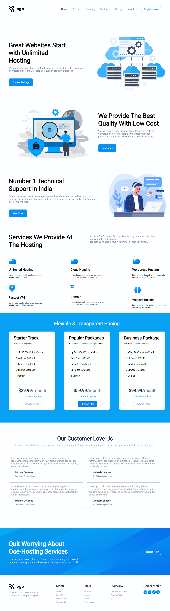

# Hosting Platform Website Landing Page

**Hi everyone, I am Raushan Kumar.**

This project is a landing page of a Hosting website built purely in HTML and CSS😎.
 
> This webpage made use of `flexbox` extensively and the use of it made the whole building process extremely joyful😃. I also learnt the importance of HTML class structure and its power while writing CSS to style it. Understanding pattern in the design of the webpage is the most important thing while writing the HTML class structure. The more better we understand it, more effective and modular HTML we can write😉. Rest for styling, Flexbox is truly a magnificient tool of CSS and makes the layout designing so simple. Building this webpage was a great learning experience that tested my patience deeply and gave me a new confidence that I can now build any webpage in pure HTML and CSS without any framework💪.

- Key learning from the project👇
    - use of `flexbox` for complex projects
    - HTML class structure
    - writing modular classes for designing purposes.

> This project took 5.5 hours to finish it and it was all worth it😀.

Below is the link and the view of the project👇👇👇
 
[HostingMania](hostingmania.netlify.app)

